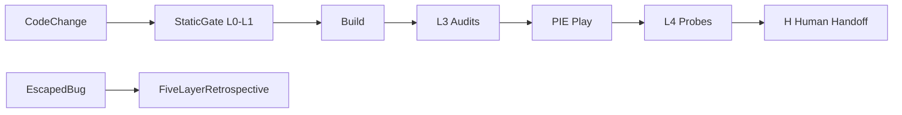

# TDD Framework (Test-Driven Discipline for UE)

Project-agnostic testing discipline for Unreal Engine prototypes. This is **not** classic
unit-test TDD. It is a layered quality gate:

```text
L0 compile/schema → L1 local checks → L2 scenario static → L3 Editor audit → L4 PIE probe → H human
```

## Components

| Piece | Layer | Role |
|---|---|---|
| Static validators | L0–L1 | `py_compile`, catalog schema, markdown links |
| Audits (`audits/`) | L3 | Editor load-only; prove config/CDO/assets exist |
| Probes (`probes/`) | L4 | Active PIE; prove runtime behavior |
| Audit aggregator | L3 | Run all audits; report every failure |
| Evidence pack | L3+ | Atomic JSON artifacts for contract gates |
| Protected Contract | L2–L4 | Registry + claims + impact domains |
| Static gate | L0–L1 | Project aggregator (e.g. `validate_all_static.py`) |

## Flow (Typical Change)



## Python Layout Convention

```text
Content/Python/
├── <project>_ops/     # atomic helpers (pie, probe_common, probe_targets)
├── <project>_project/ # catalog + validate_* scripts
├── audits/            # L3 static (optional early)
└── probes/            # L4 runtime
```

Framework code lives in `agent-stack/pylib/sdd_tdd/` — no `unreal` import.

## Docs

| File | Topic |
|---|---|
| [probe-authoring.md](probe-authoring.md) | R1–R5 probe rules |
| [audit-vs-probe.md](audit-vs-probe.md) | L3 vs L4 boundary |

## Relationship to SDD

FeatureSpecs declare **which** validation routes apply.
TDD defines **how** those routes are authored and executed.
See [../sdd/README.md](../sdd/README.md).

## Escaped Bug Routing

When user-visible regression escapes L3/L4, route through project KB module
`incident-to-guardrail-retrospective.md` — update rules, framework, probes, or KB;
do not stop at a local fix.

## Protected Contract Enablement

Use when core dependencies change (shared input, rule engine facades, grant tables).
Register claims in project Python; run static audit then runtime probes; write evidence pack.
See `pylib/sdd_tdd/contract_model.py` and `evidence_pack.py`.
